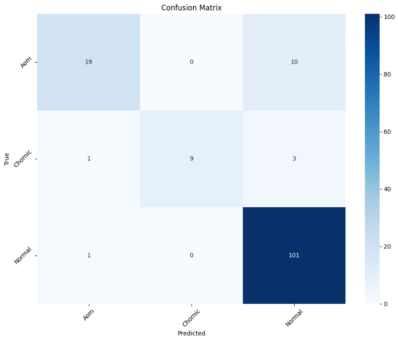

# 🧠 Ear Drum Infection Diagnosis using Deep Learning

  

## 📌 Project Overview

This project aims to automate the diagnosis of ear drum infections using advanced deep learning models. By leveraging convolutional neural networks (CNNs) and ensemble learning techniques, we classify otoscopic images into multiple categories representing different types of ear conditions. This solution can assist medical professionals in making faster, more accurate diagnoses.

---

## 📂 Dataset

The dataset consists of otoscopic images categorized into the following classes:

- 🦠 AOM (Acute Otitis Media)
- 🧬 Chronic Otitis Media
- 🌀 Ear Ventilation
- 🧹 Earwax
- 🛑 Foreign Body
- ✅ Normal
- 🔥 Otitis Externa
- 🧻 Pseudo Membrane
- 🧱 Tympanosclerosis

📁 Directory structure:
```
eardrumDs/
├── Aom/
├── Chornic/
├── Earventulation/
├── Earwax/
├── Foreign/
├── Normal/
├── OtitExterna/
├── PsuedoMembran/
└── tympanoskleros/
```

---

## 🧠 Deep Learning Models Used

We implemented and tested several powerful CNN-based architectures:

- ✅ **VGG16**
- ✅ **ResNet50**
- ✅ **DenseNet121**
- ✅ **MobileNet**
- ✅ **RegNet_X_32GF**
- ✅ **ResNeXt50_32x4d**

🔀 **Ensemble Learning** was applied to combine the strengths of these models, resulting in enhanced accuracy and robustness.

---

## ✅ Achievements

- 🔍 **Final Model Accuracy**: **92.5%**
- 🚀 Improved performance using ensemble techniques.
- 📊 High precision and recall across multiple infection classes.

---

## 🛠️ How to Run

1. Clone the repository:

   ```bash
   git clone https://github.com/Affan5370/Ear-Drum-Infection-Diagnosis-using-Deep-Learning-.git
   cd Ear-Drum-Infection-Diagnosis-using-Deep-Learning-
   ```

2. Install the dependencies:

   ```bash
   pip install -r requirements.txt
   ```

3. Open and run the notebook:

   - `Final.ipynb` – For final implementation and results.
   - `ensemble_4 (1).ipynb` – Ensemble learning implementation.

---

## 📈 Results

| Model              | Accuracy   |
|-------------------|------------|
| VGG16              | 86.46%     |
| ResNet50           | 71.96%     |
| DenseNet121        | 84.35%     |
| MobileNet          | 79.82%     |
| RegNet_X_32GF      | 85.64%     |
| ResNeXt50_32x4d    | 83.90%     |
| **Ensemble Model** | **92.5%**  |

---

## 📊 Confusion Matrix (Sample Output)



---

## 🧠 Reference

This project is inspired by and extends upon ideas presented in:
- 📄 [PeerJ CS-405: Otoscopic image classification using ensemble deep learning](https://peerj.com/articles/cs-405/)

---

## 👨‍💻 Author

**Affan Umair**  
Final Year Student, VIT Chennai  
📫 [LinkedIn](https://www.linkedin.com/in/affan-umair/)  
📧 affan.umair5370@gmail.com  

---

⭐ **If you find this project helpful, feel free to star this repository.**
